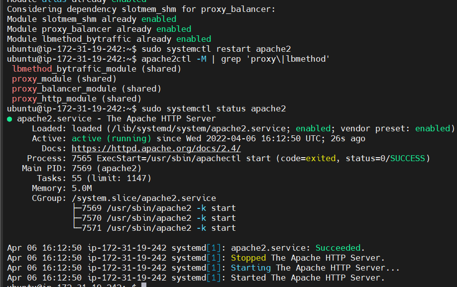

## Configuring Apache as a Load Balancer

opened tcp port 80 on ubuntu ec2 instance

updated ubuntu 

`$ sudo apt update -y`

installed apache lb on the server and configured it to point traffic coming to the lb to both web servers:

`$ sudo apt install apache2 -y`

`$ sudo apt-get install libxml2-dev`

enabling modules:

`$ sudo a2enmod rewrite`

`$ sudo a2enmod proxy`

`$ sudo a2enmod proxy_balancer`

`$ sudo a2enmod proxy_http`

`$ sudo a2enmod headers`

`$ sudo a2enmod lbmethod_bytraffic`

`$ sudo systemctl restart apache`

`$ apache2ctl -M | grep 'proxy\|lbmethod` - to confirm the modules

`$ sudo systemctl status apache2`

configuring load balancer

`$ sudo vi /etc/apache2/sites-available/000-default.conf`

`$ sudo systemctl restart apache2`

testing to ensure the configuration works

confirming the load balancer is distributing traffic to both web servers

`$ sudo tail -f /var/log/httpd/access_log`

